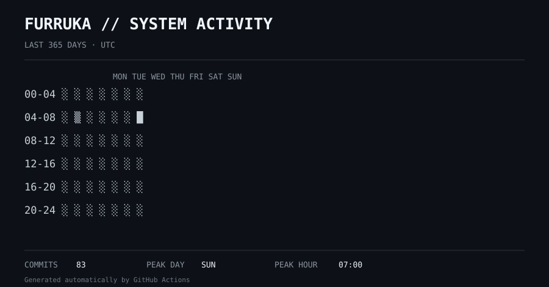
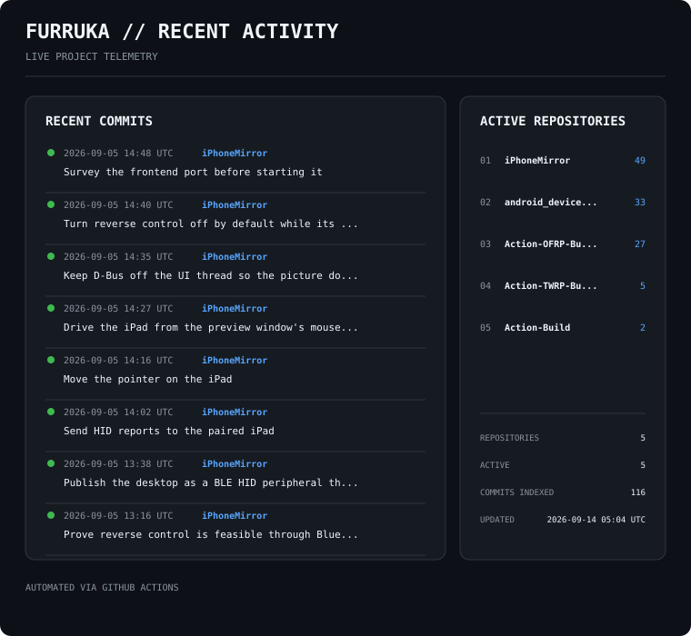

<div align="center">

# `FURRUKA`

### LOW-LEVEL SYSTEMS LAB

`Linux` · `Android` · `ARM64` · `Kernel` · `Mainline` · `DRM` · `Wayland`

<br>


<br><br>

<a href="https://github.com/Furruka">

</a>
&nbsp;
<a href="https://github.com/Furruka?tab=repositories">

</a>
&nbsp;


</div>

---

## `WHOAMI`

```text
NAME        Furruka
FOCUS       Low-level Linux / Android systems
ARCH        ARM64
KERNEL      Linux
INTERESTS   Mainline · DRM/KMS · DSI · DSC · Wayland
            Android · GSI · Custom ROM · Networking

CURRENTLY   Making mobile hardware behave on upstream Linux.
````

I like working where software stops being abstract.

Most of my time goes into **Linux kernels, Android internals, ARM64 platforms,
display pipelines, device trees, and the strange places where hardware
doesn't quite do what the documentation says it should.**

---

## `SYSTEM PROFILE`

<table>
<tr>
<td width="50%" valign="top">

### `KERNEL`

```text
Linux Kernel        ████████████████████
Device Tree         ██████████████████░░
Kernel Debugging    █████████████████░░░
GKI / Android       ████████████████░░░░
Mainline Porting    █████████████████░░░
```

</td>

<td width="50%" valign="top">

### `PLATFORM`

```text
ARM64               ████████████████████
Android             ██████████████████░░
Embedded Linux      █████████████████░░░
Wayland             ███████████████░░░░░
Networking           ████████████████░░░░
```

</td>
</tr>
</table>

---

## `ENGINEERING STACK`

### `LOW LEVEL`


### `ANDROID`


### `GRAPHICS & DISPLAY`


### `NETWORKING`


---

## `CURRENTLY BUILDING`

```text
┌─────────────────────────────────────────────────────────────┐
│                                                             │
│  MT6895 / ARM64                                             │
│  └── Mainline Linux 6.x                                    │
│      ├── Device Tree                                       │
│      ├── DRM / KMS                                         │
│      ├── DSI                                                │
│      ├── DSC                                                │
│      └── Display bring-up                                  │
│                                                             │
│  Android                                                    │
│  ├── Custom Kernel                                          │
│  ├── GSI                                                     │
│  ├── Custom ROM                                             │
│  └── Mainline experiments                                  │
│                                                             │
└─────────────────────────────────────────────────────────────┘
```

> **Current mission:** upstream mobile hardware, one subsystem at a time.

---

## `PROJECT LAB`

<table>
<tr>
<td width="50%" valign="top">

### 🐧 `MAINLINE LINUX`

Working on bringing mobile SoCs closer to a proper upstream Linux environment.

**Focus**

* ARM64
* Device Tree
* Kernel bring-up
* MediaTek platforms
* Mainline Linux
* Hardware debugging

</td>

<td width="50%" valign="top">

### 📱 `ANDROID`

Exploring the lower layers of the Android stack.

**Focus**

* Android Kernel
* GKI
* GSI
* AOSP
* LineageOS
* Custom ROMs

</td>
</tr>

<tr>
<td width="50%" valign="top">

### 🖥️ `DISPLAY PIPELINE`

The fun begins when the screen doesn't turn on.

**Focus**

* DRM / KMS
* MIPI DSI
* DSC
* OVL / RDMA
* Display Mutex
* Panel bring-up

</td>

<td width="50%" valign="top">

### 🌐 `NETWORKING`

Linux networking from packets to policy.

**Focus**

* DNS
* dnsmasq
* nftables
* TProxy
* IPv6
* Smart DNS
* Embedded routers

</td>
</tr>
</table>

---

## `GITHUB TELEMETRY`

<div align="center">

<a href="https://github.com/Furruka">
  
</a>

<a href="https://github.com/Furruka">
  
</a>

</div>

---

## `SYSTEM ACTIVITY`

<div align="center">



</div>

---

## `RECENT ACTIVITY`

<div align="center">



</div>

---

## `CONTRIBUTION MATRIX`

<div align="center">


</div>

---

## `CONTRIBUTION SNAKE`

<div align="center">

<picture>
  <source
    media="(prefers-color-scheme: dark)"
    srcset="https://raw.githubusercontent.com/Furruka/Furruka/output/github-contribution-grid-snake-dark.svg">
  <source
    media="(prefers-color-scheme: light)"
    srcset="https://raw.githubusercontent.com/Furruka/Furruka/output/github-contribution-grid-snake.svg">
  
</picture>

</div>

---

## `DEVELOPMENT LOG`

```text
2026 ─────────────────────────────────────────────────────────

[09]  Mainline Linux / Android kernel work
      └── ARM64 / MediaTek / display pipeline

[08]  DRM / DSI / DSC debugging
      └── tracing the path from userspace to panel

[08]  Linux desktop / Wayland experiments
      └── ARM64 mobile hardware

[07]  Kernel bring-up
      └── device tree / drivers / boot flow

──────────────────────────────────────────────────────────────
```

> Hardware is honest.
> The logs are just better at explaining why.

---

## `TOOLS I LIVE IN`

```text
EDITOR
  ├─ Neovim
  └─ VS Code

TERMINAL
  ├─ Bash
  ├─ Git
  └─ SSH

LINUX
  ├─ Arch Linux
  ├─ Mainline Kernel
  └─ Embedded Linux

ANDROID
  ├─ AOSP
  ├─ LineageOS
  ├─ fastboot
  └─ adb

DEBUG
  ├─ dmesg
  ├─ ftrace
  ├─ debugfs
  ├─ sysfs
  └─ register dumps
```

---

## `PHILOSOPHY`

<div align="center">

### `READ THE CODE.`

### `TRACE THE HARDWARE.`

### `QUESTION THE ABSTRACTION.`

### `FIX THE ROOT CAUSE.`

</div>

---

## `OPEN SOURCE`

I enjoy working on projects where the interesting part is figuring out **why**
something works — and even more when it doesn't.

If something here helps you, feel free to explore the repositories.

```text
┌───────────────────────────────────────────────┐
│                                               │
│   software → kernel → driver → hardware       │
│                                               │
│   that's where things get interesting.        │
│                                               │
└───────────────────────────────────────────────┘
```

---

<div align="center">

### `FURRUKA`

`BUILD · BREAK · TRACE · FIX · REPEAT`

<sub>Powered by curiosity, Linux and an unreasonable number of logs.</sub>

</div>
